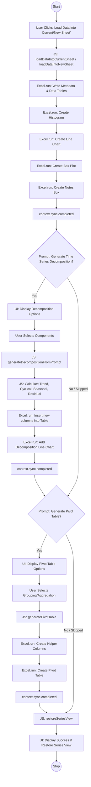

```mermaid
%% Activity Diagram: Load Data & Perform Analysis Workflow
flowchart TD
    Start((Start)) --> A[User Clicks 'Load Data into Current/New Sheet']
    
    %% Initial Data Load
    A --> B[JS: loadDataIntoCurrentSheet / loadDataIntoNewSheet]
    B --> C[Excel.run: Write Metadata & Data Tables]
    C --> D[Excel.run: Create Histogram]
    D --> E[Excel.run: Create Line Chart]
    E --> F[Excel.run: Create Box Plot]
    F --> G[Excel.run: Create Notes Box]
    G --> H[context.sync completed]
    
    %% Decomposition Decision
    H --> I{Prompt: Generate Time Series Decomposition?}
    
    I -->|Yes| J[UI: Display Decomposition Options]
    J --> K[User Selects Components]
    K --> L[JS: generateDecompositionFromPrompt]
    L --> M[JS: Calculate Trend, Cyclical, Seasonal, Residual]
    M --> N[Excel.run: Insert new columns into Table]
    N --> O[Excel.run: Add Decomposition Line Chart]
    O --> P[context.sync completed]
    
    %% Pivot Table Decision
    P --> Q{Prompt: Generate Pivot Table?}
    I -->|No / Skipped| Q
    
    Q -->|Yes| R[UI: Display Pivot Table Options]
    R --> S[User Selects Grouping/Aggregation]
    S --> T[JS: generatePivotTable]
    T --> U[Excel.run: Create Helper Columns]
    U --> V[Excel.run: Create Pivot Table]
    V --> W[context.sync completed]
    
    %% Wrap Up
    W --> X[JS: restoreSeriesView]
    Q -->|No / Skipped| X
    
    X --> Y[UI: Display Success & Restore Series View]
    Y --> Stop((Stop))
```