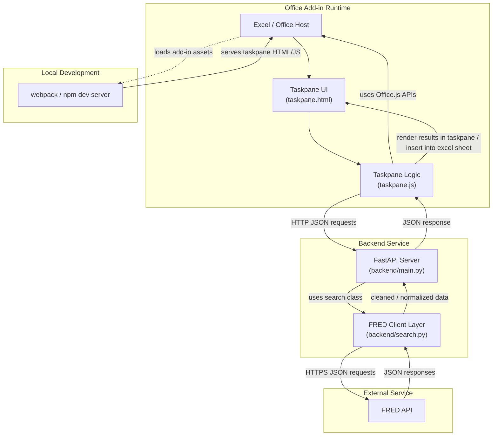

```mermaid
flowchart TD
  subgraph OfficeAddin["Office Add-in Runtime"]
    OfficeHost["Excel / Office Host"]
    UI["Taskpane UI\n(taskpane.html)"]
    JS["Taskpane Logic\n(taskpane.js)"]
    OfficeHost --> UI
    UI --> JS
    JS -->|uses Office.js APIs| OfficeHost
  end

  subgraph Backend["Backend Service"]
    API["FastAPI Server\n(backend/main.py)"]
    Search["FRED Client Layer\n(backend/search.py)"]
    API -->|uses search class| Search
  end

  subgraph External["External Service"]
    FRED["FRED API"]
  end

  JS -->|HTTP JSON requests| API
  Search -->|HTTPS JSON requests| FRED
  FRED -->|JSON responses| Search
  Search -->|cleaned / normalized data| API
  API -->|JSON response| JS
  JS -->|render results in taskpane / insert into excel sheet| UI

  subgraph LocalDev["Local Development"]
    Dev["webpack / npm dev server"]
    Dev -->|serves taskpane HTML/JS| OfficeHost
    OfficeHost -.->|loads add-in assets| Dev
  end
```