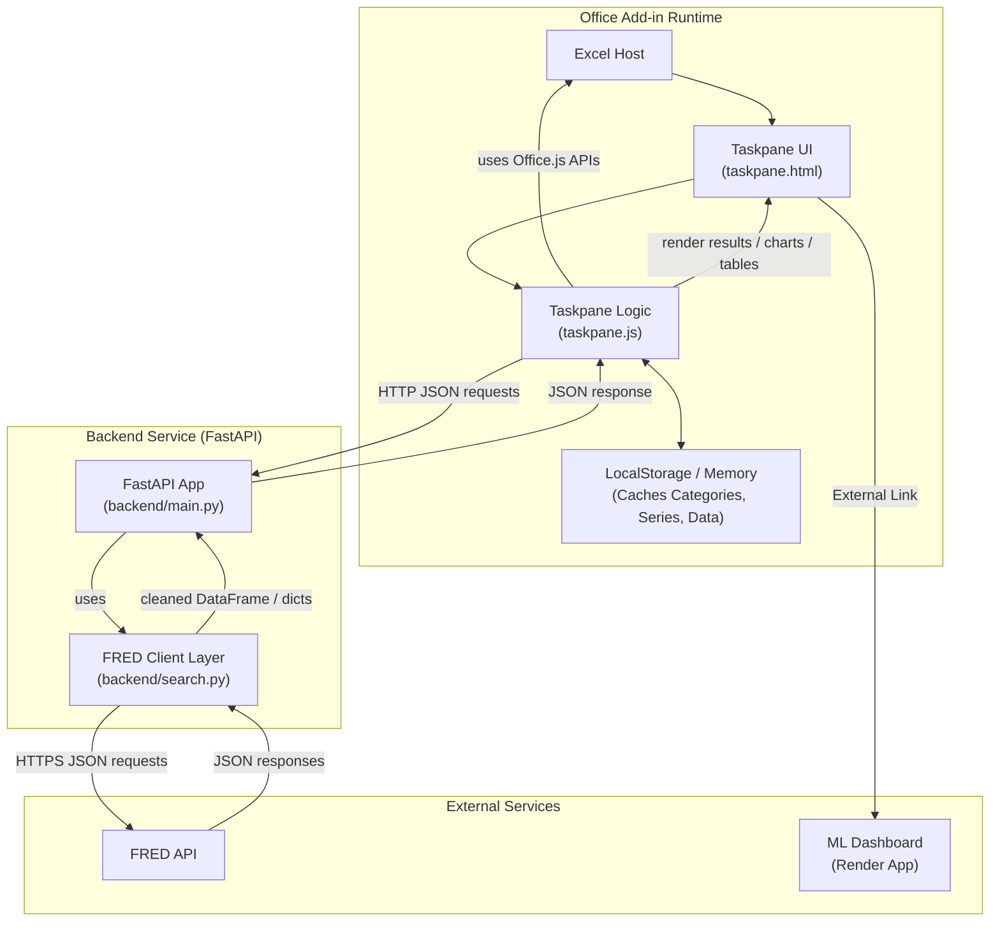

```mermaid
flowchart TD
  subgraph OfficeAddin["Office Add-in Runtime"]
    OfficeHost["Excel Host"]
    UI["Taskpane UI\n(taskpane.html)"]
    JS["Taskpane Logic\n(taskpane.js)"]
    Cache["LocalStorage / Memory\n(Caches Categories, Series, Data)"]
    
    OfficeHost --> UI
    UI --> JS
    JS <--> Cache
    JS -->|uses Office.js APIs| OfficeHost
  end

  subgraph Backend["Backend Service (FastAPI)"]
    API["FastAPI App\n(backend/main.py)"]
    Search["FRED Client Layer\n(backend/search.py)"]
    API -->|uses| Search
  end

  subgraph External["External Services"]
    FRED["FRED API"]
    MLDash["ML Dashboard\n(Render App)"]
  end

  JS -->|HTTP JSON requests| API
  UI -->|External Link| MLDash
  Search -->|HTTPS JSON requests| FRED
  FRED -->|JSON responses| Search
  Search -->|cleaned DataFrame / dicts| API
  API -->|JSON response| JS
  JS -->|render results / charts / tables| UI
```