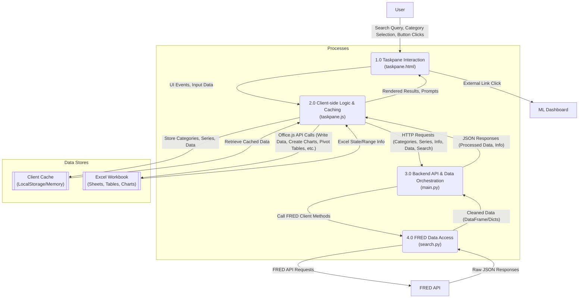

```mermaid
%% Data Flow Diagram (Level 1)
flowchart TD
    %% External Entities
    A[User]
    B[FRED API]
    C[ML Dashboard]

    %% Processes
    subgraph Processes
        P1("1.0 Taskpane Interaction\n(taskpane.html)")
        P2("2.0 Client-side Logic & Caching\n(taskpane.js)")
        P3("3.0 Backend API & Data Orchestration\n(main.py)")
        P4("4.0 FRED Data Access\n(search.py)")
    end

    %% Data Stores
    subgraph Data Stores
        D1[["Client Cache\n(LocalStorage/Memory)"]]
        D2[["Excel Workbook\n(Sheets, Tables, Charts)"]]
    end

    %% Data Flows
    A -- Search Query, Category Selection, Button Clicks --> P1
    P1 -- UI Events, Input Data --> P2
    P2 -- Store Categories, Series, Data --> D1
    D1 -- Retrieve Cached Data --> P2

    P2 -- HTTP Requests (Categories, Series, Info, Data, Search) --> P3
    P3 -- Call FRED Client Methods --> P4
    P4 -- FRED API Requests --> B
    B -- Raw JSON Responses --> P4
    P4 -- Cleaned Data (DataFrame/Dicts) --> P3
    P3 -- JSON Responses (Processed Data, Info) --> P2

    P2 -- Office.js API Calls (Write Data, Create Charts, Pivot Tables, etc.) --> D2
    D2 -- Excel State/Range Info --> P2
    P2 -- Rendered Results, Prompts --> P1
    P1 -- External Link Click --> C
```