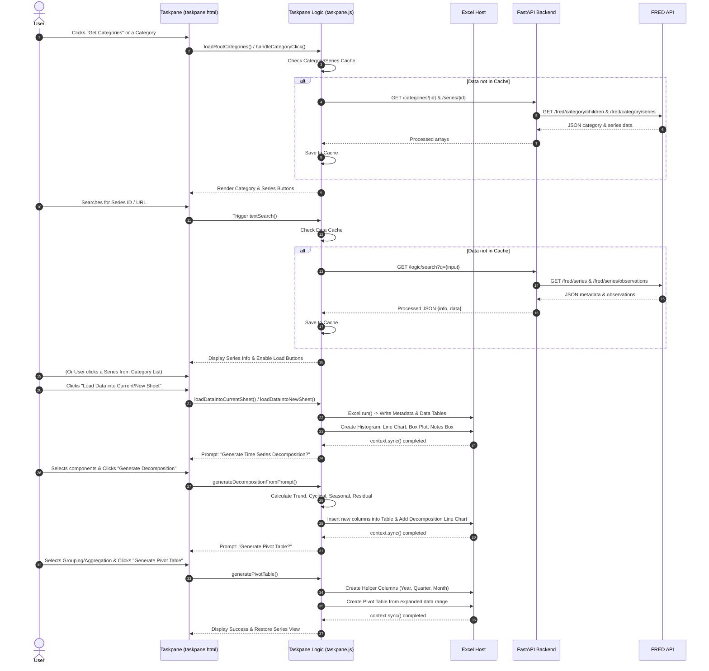

```mermaid
sequenceDiagram
    autonumber
    actor User
    participant UI as Taskpane (taskpane.html)
    participant JS as Taskpane Logic (taskpane.js)
    participant Excel as Excel Host
    participant API as FastAPI Backend
    participant FRED as FRED API

    %% Scenario 1: Category Browsing (Alternative to Search)
    User->>UI: Clicks "Get Categories" or a Category
    UI->>JS: loadRootCategories() / handleCategoryClick()
    JS->>JS: Check Category/Series Cache
    alt Data not in Cache
        JS->>API: GET /categories/{id} & /series/{id}
        API->>FRED: GET /fred/category/children & /fred/category/series
        FRED-->>API: JSON category & series data
        API-->>JS: Processed arrays
        JS->>JS: Save to Cache
    end
    JS-->>UI: Render Category & Series Buttons

    %% Scenario 2: Search via Search Box & Cache Data
    User->>UI: Searches for Series ID / URL
    UI->>JS: Trigger textSearch()
    JS->>JS: Check Data Cache
    alt Data not in Cache
        JS->>API: GET /logic/search?q={input}
        API->>FRED: GET /fred/series & /fred/series/observations
        FRED-->>API: JSON metadata & observations
        API-->>JS: Processed JSON {info, data}
        JS->>JS: Save to Cache
    end
    JS-->>UI: Display Series Info & Enable Load Buttons
    User->>UI: (Or User clicks a Series from Category List)

    %% Scenario 3: Load Data & Generate Charts
    User->>UI: Clicks "Load Data into Current/New Sheet"
    UI->>JS: loadDataIntoCurrentSheet() / loadDataIntoNewSheet()
    JS->>Excel: Excel.run() -> Write Metadata & Data Tables
    JS->>Excel: Create Histogram, Line Chart, Box Plot, Notes Box
    Excel-->>JS: context.sync() completed
    JS-->>UI: Prompt: "Generate Time Series Decomposition?"

    %% Scenario 4: Time Series Decomposition
    User->>UI: Selects components & Clicks "Generate Decomposition"
    UI->>JS: generateDecompositionFromPrompt()
    JS->>JS: Calculate Trend, Cyclical, Seasonal, Residual
    JS->>Excel: Insert new columns into Table & Add Decomposition Line Chart
    Excel-->>JS: context.sync() completed
    JS-->>UI: Prompt: "Generate Pivot Table?"

    %% Scenario 5: Pivot Table Generation
    User->>UI: Selects Grouping/Aggregation & Clicks "Generate Pivot Table"
    UI->>JS: generatePivotTable()
    JS->>Excel: Create Helper Columns (Year, Quarter, Month)
    JS->>Excel: Create Pivot Table from expanded data range
    Excel-->>JS: context.sync() completed
    JS-->>UI: Display Success & Restore Series View
```