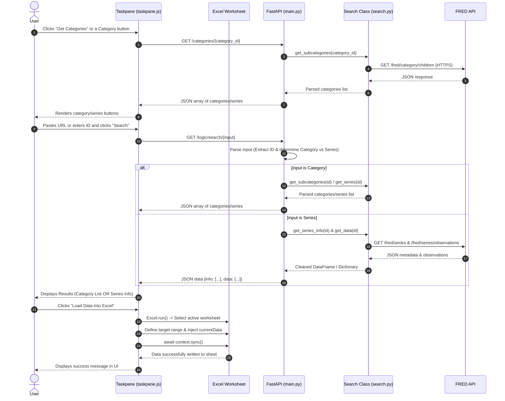

```mermaid
sequenceDiagram
    autonumber
    actor User
    participant UI as Taskpane (taskpane.js)
    participant Excel as Excel Worksheet
    participant API as FastAPI (main.py)
    participant Search as Search Class (search.py)
    participant FRED as FRED API

    %% Scenario 1: Category/Series Browsing
    User->>UI: Clicks "Get Categories" or a Category button
    UI->>API: GET /categories/{category_id}
    API->>Search: get_subcategories(category_id)
    Search->>FRED: GET /fred/category/children (HTTPS)
    FRED-->>Search: JSON response
    Search-->>API: Parsed categories list
    API-->>UI: JSON array of categories/series
    UI-->>User: Renders category/series buttons

    %% Scenario 2: Search (Handles IDs & URLs for Categories and Series)
    User->>UI: Pastes URL or enters ID and clicks "Search"
    UI->>API: GET /logic/search/{input}
    API->>API: Parse input (Extract ID & determine Category vs Series)
    
    alt input is Category
        API->>Search: get_subcategories(id) / get_series(id)
        Search-->>API: Parsed categories/series list
        API-->>UI: JSON array of categories/series
    else input is Series
        API->>Search: get_series_info(id) & get_data(id)
        Search->>FRED: GET /fred/series & /fred/series/observations
        FRED-->>Search: JSON metadata & observations
        Search-->>API: Cleaned DataFrame / Dictionary
        API-->>UI: JSON data {info: [...], data: [...]}
    end
    
    UI-->>User: Displays Results (Category List OR Series Info)

    %% Scenario 3: Insert into Excel
    User->>UI: Clicks "Load Data into Excel"
    UI->>Excel: Excel.run() -> Select active worksheet
    UI->>Excel: Define target range & inject currentData
    UI->>Excel: await context.sync()
    Excel-->>UI: Data successfully written to sheet
    UI-->>User: Displays success message in UI
```